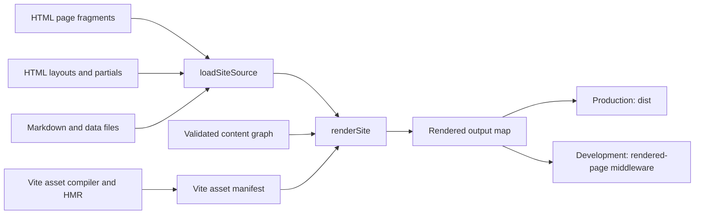

# Architecture Refactor Project Plan

## Purpose

Replace the builder's coupled Vite lifecycle, regex template substitution, and handwritten content parsing with a deterministic site renderer. Templates remain HTML files on disk. Vite remains responsible for compiling and serving client assets.

This is a staged refactor. Each phase should leave the production site buildable and retain the existing output unless the phase explicitly changes generated content.

## Target Architecture

`loadSiteSource()` reads the filesystem once and returns an immutable source snapshot. `renderSite()` is pure: it accepts that snapshot, a validated content graph, and an asset descriptor, then returns a map of output paths to complete HTML documents and renderer-owned JSON. Production writes that map to `dist/`; development serves it from memory. Neither caller reimplements template processing.

## Guiding Decisions

- Templates, layouts, and partials remain `.html` files on disk.
- The authoring format stays valid HTML. Build-only semantics use standard `<template>` elements and `data-kbr-*` attributes.
- Do not adopt an off-the-shelf SSG framework or a template-language library. Parser, serializer, YAML, schema-validation, and test libraries are acceptable leaf dependencies.
- The renderer parses HTML into an AST and serializes it. It must not implement structural rendering with regular expressions.
- Dynamic text is escaped by default. Raw HTML is inserted only at explicit template call sites.
- Frontmatter uses TOML between `+++` delimiters and is validated before any rendering occurs. Dates remain quoted `YYYY-MM-DD` strings and are validated by the content schema.
- Use the `toml` package directly for TOML 1.1 parsing. Its TypeScript declarations, zero runtime dependencies, Node 20+ support, and strict parsing behavior fit the Node 24+ build environment.
- Vite compiles JavaScript and CSS. The renderer owns placement of the resulting asset references in final HTML.
- Vite builds `main.ts` as an explicit input with `build.manifest` enabled and `base: "/"`. `index.html` is an ordinary source page, not a Vite HTML entry.
- A template renderer never reads files. Loading, parsing content, graph construction, and rendering are separate operations with explicit input and output types.
- Use `parse5` directly for HTML parsing and serialization. This renderer needs a small, bespoke set of transformations and direct source-location control; it does not need rehype's general plugin pipeline or HAST abstraction.
- Each phase has a narrow test suite plus `npm run build`; update output snapshots only after reviewing intentional changes.

## Template Directive Contract

Use this contract as the implementation boundary for the HTML renderer. Do not introduce general JavaScript evaluation in templates.

| Need               | HTML authoring form                                                                                  | Renderer behavior                                                                                                         |
| ------------------ | ---------------------------------------------------------------------------------------------------- | ------------------------------------------------------------------------------------------------------------------------- |
| Include markup     | `<template data-kbr-include="partials/header.html"></template>`                                      | Replace with the referenced fragment, recursively. Paths resolve relative to the including file.                          |
| Choose layout      | `<template data-kbr-page data-layout="base.html">...</template>`                                     | Extract validated page metadata and select the named layout. Markdown documents select a layout through typed metadata.   |
| Insert page body   | `<template data-kbr-slot="content"></template>`                                                      | Insert the already-rendered page-fragment subtree into a layout.                                                          |
| Conditional markup | `<template data-kbr-if="post.series">...</template>`                                                 | Replace with expanded child nodes when the expression is truthy; otherwise remove it.                                     |
| Repeated markup    | `<template data-kbr-for="tag of post.tags">...</template>`                                           | Clone and render child nodes for each iterable item.                                                                      |
| Escaped value      | `{{ post.title }}`                                                                                   | Resolve a dot-path and escape for its text or attribute context.                                                          |
| Raw HTML           | `<template data-kbr-html="post.renderedContent"></template>`                                         | Insert an opaque, explicitly trusted serialized fragment verbatim. Never parse, traverse, interpolate, or reserialize it. |
| Page metadata      | `<template data-kbr-page data-layout="base.html"><meta name="title" content="Example" /></template>` | Extract and validate its meta-style child elements, then remove the inert element from output.                            |
| Asset placement    | `<template data-kbr-assets="head"></template>`                                                       | Insert stylesheet and preload tags. A corresponding `body` placement inserts scripts.                                     |

`<template>` is inert, valid HTML, and can occur inside strict structures such as lists without leaving custom control nodes in final output. Existing `kbr-*` elements remain runtime web components unless a specific component is intentionally replaced by static markup.

The initial expression grammar is deliberately limited to identifiers and dot paths. `data-kbr-for` adds a local item identifier. Render the page fragment first, then insert that rendered subtree into its selected layout and render the layout. Page fragments therefore may use directives independently of their layout.

Truthiness is explicit: `null`, `undefined`, `false`, an empty string, and an empty array are false; all other values, including `0`, are true. Missing values are build errors when a path root is unknown or when a required path cannot resolve. Optional values must be protected by `data-kbr-if`; conditional class names and attributes belong in the typed view model rather than a new attribute-level directive.

Interpolation applies only to text and attribute nodes. It never runs inside `script` or `style` elements. Every AST node has an origin record (source file and location) captured at parse time; include expansion and loop cloning preserve that record for diagnostics. Walkers must recurse through `template.content`, not just an element's ordinary child nodes.

Includes resolve from the site source root and may not escape it. Missing values, malformed directives, include cycles, invalid loop expressions, and incorrect raw-HTML targets are build errors that report the originating file and position.

## Agent Implementation Sequence

The phase documents below are the implementation authority. An agent starts with Phase 0 and may begin the next phase only after the current document's hard gates pass. The work-plan sections that follow are retained as architecture-level summaries.

1. [Phase 0: Baseline And Contracts](phases/phase-0-baseline.md)
2. [Phase 1: Pure Rendering Boundary](phases/phase-1-pure-rendering-boundary.md)
3. [Phase 2: HTML AST Renderer](phases/phase-2-html-ast-renderer.md)
4. [Phase 3: Template Repetition And Post Markup](phases/phase-3-template-repetition.md)
5. [Phase 4: TOML Content Graph](phases/phase-4-validated-content-graph.md)
6. [Phase 5: Static Content And Progressive Enhancement](phases/phase-5-static-content-enhancement.md)
7. [Phase 6: Retire Legacy Infrastructure](phases/phase-6-retire-legacy-infrastructure.md)

## Work Plan

### Phase 0: Establish the Baseline

**Goal:** Make the existing behavior measurable before moving architectural boundaries.

1. Run `npm test` and `npm run build` on the current branch.
2. Review and repair any failing tests that are already expected to pass before beginning the refactor; do not fold unrelated fixes into this project.
3. Record the generated HTML and JSON surface covered by [build-output.test.ts](../../../source/builder/build-output.test.ts).
4. Add focused characterization tests for the current page and Markdown rendering boundary if snapshots do not isolate it well enough.
5. Add a normalized DOM comparison helper for output-parity checks. It must compare parsed document structure while deliberately ignoring serializer-only whitespace and attribute-order changes.
6. Confirm the directive contract above: meta-style child elements in `data-kbr-page`, `data-layout` for page fragments, explicit `data-kbr-slot`, opaque trusted raw fragments, and defined truthiness.

**Exit criteria**

- `npm test` and `npm run build` pass.
- The team has reviewed a known-good output snapshot baseline.
- The normalized DOM comparator protects Phase 2 from accepting a broad serializer rewrite as a whitespace-only change.
- Directive syntax, layout selection, raw-HTML behavior, truthiness, and page metadata syntax are decided before implementation begins.

### Phase 1: Create a Pure Rendering Boundary

**Goal:** Establish a pure, single callable rendering API and make Vite an asset compiler before changing template syntax.

1. Define renderer-owned types:
   - `LoadedSiteSource`: immutable filesystem snapshot of page fragments, layouts, partials, raw data inputs, and source origins.
   - `SiteAssets`: stylesheet, modulepreload, and module-script references separated by insertion location.
   - `RenderedSite`: `Map<string, string>` for output documents, plus explicitly typed JSON outputs if they remain renderer-owned.
   - `RenderMode`: development or production, only where asset references materially differ.
   - Input types for HTML pages, discovered Markdown documents, layouts, and templates.
2. Implement `loadSiteSource()` as the only filesystem reader for renderer-owned source. `renderSite()` must accept loaded source, content data, and assets without reading from disk.
3. Change Vite configuration before extraction: make `main.ts` the explicit Rollup input, enable `build.manifest`, set `base: "/"`, and remove `index.html` from Vite's HTML-entry role. Treat it as an ordinary renderer input.
4. Extract the current rendering sequence from `index.ts`, `html-bundle-processor.ts`, and `dev-server-middleware.ts` behind a new `renderSite()` entry point. Keep existing `TemplateProcessor` behavior internally for this phase; the change is ownership and call flow, not template semantics.
5. Have production build assets first, read the Vite manifest into `SiteAssets`, then call `renderSite()` and write its output.
6. Have development call the same renderer with development assets and route every rendered document through `server.transformIndexHtml()` so Vite owns the HMR client and development HTML transforms.
7. On any page, template, content, theme, or renderer-owned data change, rebuild the complete render map and request a full reload. The site is small enough that per-file renderer caches add risk without a measured benefit.
8. Add tests that render a fixed in-memory fixture set in development and production modes, asserting that document structure differs only in expected asset URLs.

**Exit criteria**

- Production and development no longer invoke separate page-template paths.
- One pure API produces every final HTML document from a supplied source snapshot.
- Production asset tags are inserted by renderer-owned logic from Vite's manifest; no Vite HTML transform or `generateBundle()` string repair remains.
- The placement normalizer, development-entry stripper, and source-page requirement for a Vite entry script are deleted.
- Existing output snapshots remain unchanged except for reviewed root-absolute asset URLs and asset ordering/placement corrections.

### Phase 2: Replace Regex Rendering with an HTML AST Renderer

**Goal:** Replace `TemplateEngine`, `TemplateProcessor`, and raw-string partial injection with the valid-HTML directive contract.

1. Install `parse5` as the HTML parser/serializer with source-location support. Keep transformations in renderer-owned modules rather than adding the `rehype`/`unified` plugin stack. This is a leaf parser dependency, not a template-language library.
2. Implement the renderer in isolated transformations, each with focused fixtures and tests:
   - load and parse HTML documents and fragments;
   - resolve `data-kbr-include` recursively with relative paths and cycle detection;
   - extract/remove `data-kbr-page` metadata;
   - expand `data-kbr-if`;
   - substitute escaped values in text and attribute nodes;
   - insert opaque trusted raw fragments only through `data-kbr-html`;
   - serialize complete documents without leaving build directives behind.
3. Implement origin propagation through includes and loop clones, and test diagnostics from a nested include and a cloned template body.
4. Migrate `base.html`, `blog-post.html`, `head.html`, `header.html`, and `footer.html` to directive syntax, including `data-kbr-slot="content"` and `data-kbr-assets` placement.
5. Add the `data-kbr-page` meta-child schema and migrate authored pages from metadata comments. Do not retain a metadata-comment compatibility adapter after the migration.
6. Make unresolved values errors according to the render-contract rules. Optional markup uses `data-kbr-if`; no silent cleanup pass exists.
7. Remove the raw HTML variable-name allowlist, `TemplateEngine`, `TemplateProcessor`, and metadata extractor only after all layouts and pages are migrated.

**Exit criteria**

- All layouts and partials are valid HTML and render through an AST.
- Includes, conditionals, escaped substitutions, nested paths, and explicit raw HTML have focused test coverage.
- Literal `{{ ... }}` text inside Markdown-derived raw HTML survives unchanged, and raw fragments remain byte-for-byte opaque across rendering.
- Include cycles and unresolved required values fail with the source file and directive location.
- The renderer does not interpolate `script` or `style` contents, including the theme bootstrap script.
- Existing production page output passes normalized DOM parity checks apart from reviewed intentional changes.

### Phase 3: Move Existing Repeated HTML into Templates

**Goal:** Add loops only after the core HTML renderer is trusted, then remove HTML construction from TypeScript where the markup belongs in templates.

1. Implement `data-kbr-for` with local loop scope and dot-path expressions.
2. Add optional conditional structures needed within loops, especially citations with optional `url`, `purchaseUrl`, and multiple back-references.
3. Create template fragments for:
   - blog post title/date metadata;
   - post tag buttons;
   - citation reference-list items and container;
   - supplement list items, where static output is introduced later.
4. Keep citation reference scanning, validation, numbering, and back-reference target calculation in the content-processing layer. Change its output from HTML strings to typed citation view data.
5. Make a leading Markdown H1 a content validation error. The layout always renders the document title, so title ownership is singular and predictable.
6. Change Markdown processing to supply rendered Markdown as the only trusted page-body HTML value and to supply typed display data for layout fragments.
7. Delete `injectTitleAndMetadata`, `createBlogMetadataHTML`, `generateTagsHtml`, and citation-list HTML string generation after their template equivalents are live.

**Exit criteria**

- The renderer supports list rendering without custom control elements appearing in final HTML.
- Tags, citations, and blog metadata are represented as HTML templates plus typed data, not builder string literals.
- Author-supplied metadata is escaped in text and attributes. URL schemes are validated separately where a template emits a navigable URL; HTML escaping alone is not URL sanitization.
- Citation tests retain validation and numbering coverage while gaining rendered-template coverage.

### Phase 4: Build a Validated Content Graph

**Goal:** Replace handwritten frontmatter parsing and implicit path-derived relationships with typed, validated content records.

1. Install `toml` and Zod. Parse TOML frontmatter between `+++` delimiters; do not retain YAML parsing support after source content is migrated.
2. Define separate schemas for:
   - published posts;
   - supplements;
   - page metadata;
   - series entries;
   - citations;
   - draft content, using a deliberately lenient schema mode for authoring-time validation.
3. Parse frontmatter once, retaining file path and field-level diagnostics for every TOML parsing or validation error. Keep the admin backlog parser/writer separate: it parses heading-based `backlog.md`, not frontmatter.
4. Define a `ContentGraph` with typed document nodes, explicit parent/supplement edges, sorted post collections, tag summaries, series collections, and renderer-required structured data such as home highlights from `public/data/experience-data.json`.
5. Move publication filtering, duplicate URL detection, supplement-parent validation, and series validation into graph construction. Sort posts deterministically by date, then slug.
6. Replace downstream `[key: string]: any` metadata with discriminated/typed content records and narrow render view models.
7. Replace locale-dependent date formatting with a fixed month-name table or equivalent deterministic formatter.
8. Make theme-manifest generation a renderer-owned JSON output, remove its generated timestamp, and keep its source data in the loaded source snapshot.
9. Update `validate-drafts.ts` and draft discovery to use the lenient draft schema mode.
10. Delete the handwritten field-by-field frontmatter parser only once fixture coverage proves equivalent accepted content and clearer invalid-content failures.

**Exit criteria**

- Invalid frontmatter fails the build with source path, field path, and actionable error text.
- A typo such as `tag:` cannot silently publish a post without tags.
- Parent/supplement relationships are typed graph edges, not re-derived in templates or output path slicing.
- All rendering inputs are typed; templates receive small, purpose-built view models rather than an open metadata bag.
- Date labels, post ordering, and JSON output are deterministic across supported Node environments.
- Theme and experience data are loaded once and available through explicit renderer inputs.

### Phase 5: Statically Render Known Content Collections

**Goal:** Generate useful HTML without JavaScript while retaining client components for interaction and enhancement.

1. Render the blog page from the `ContentGraph`:
   - post cards;
   - tag filter controls;
   - post tag data needed for DOM filtering.
2. Render home-page highlights, series navigation, and supplement lists from typed content data.
3. Define an explicit enhancement contract and styling plan for each current shadow-DOM component. Pre-rendered light DOM cannot inherit a component's shadow stylesheet, so each component must either move its static styles into page CSS and enhance light DOM, remain client-only, or be replaced by static HTML plus a small behavior module.
4. Update `kbr-post-list`, `kbr-tag-filter`, `kbr-post-series`, `kbr-supplement-list`, and `kbr-home-highlights` according to those contracts so they do not duplicate pre-rendered markup or fetch data required to render first paint. Replace the current composed-event tag filtering with DOM behavior over pre-rendered cards and their tag data attributes where applicable.
5. Inline or bundle icon data when feasible, eliminating the per-icon runtime fetch behavior.
6. Retain `blog-manifest.json` only for APIs or dynamic behavior that demonstrably still need it.
7. Update snapshots intentionally: this phase should change blog and homepage output by adding meaningful static content.

**Exit criteria**

- The built blog page contains post titles, descriptions, links, dates, and filter controls with JavaScript disabled.
- Series and supplement navigation have usable static fallbacks.
- Progressive enhancement does not duplicate static items or cause visible layout shifts.
- Static content is styled before component upgrade; no component hides or replaces its pre-rendered light DOM unexpectedly.
- Search engines and link-preview clients receive meaningful listing-page content.

### Phase 6: Simplify Vite Integration and Retire Old Infrastructure

**Goal:** Make Vite an asset compiler/server and remove code made obsolete by `renderSite()`.

1. Replace the plugin `buildStart`/`generateBundle` orchestration with an explicit build command that reads the Vite asset manifest, loads source, builds the content graph, calls `renderSite()`, and writes its result to `dist/`.
2. Use a normal Vite dev server for assets and HMR; retain only the minimal middleware that serves the complete in-memory render map and applies `server.transformIndexHtml()`.
3. Remove dev asset injection, production dev-entry removal, asset-placement normalization, duplicate template cache clearing, and duplicate per-route render paths.
4. Remove duplicate MIME, 404, and manifest-serving implementations where Vite or the renderer now owns that responsibility.
5. Remove `git-aware-pipeline.ts`, `git-utils.ts`, and stale-output reconciliation once full builds are the default. Reintroduce caching only with measured need and a content-hash design.
6. Update scripts, README files, Netlify configuration if necessary, and contributor documentation.

**Exit criteria**

- There is no `generateBundle()` HTML emission dance or post-build asset relocation.
- Development and production call the same rendering API.
- The rendered site builds from a clean checkout with `npm run build` and deploys using the documented Netlify command.
- Obsolete builder modules and scripts are deleted, with no dead compatibility path remaining.

## Test Strategy

| Layer              | Coverage                                                                                                                                                                                                                                                                         |
| ------------------ | -------------------------------------------------------------------------------------------------------------------------------------------------------------------------------------------------------------------------------------------------------------------------------- |
| Directive renderer | Include resolution/cycles/root escape, conditions and defined truthiness, loops, `template.content` traversal, escaped text/attributes, opaque raw insertion, script/style exclusion, missing data, malformed directives, origins, metadata, layouts/slots, and asset placement. |
| Content graph      | Valid and invalid TOML fixtures, strict and lenient draft schema modes, schema messages, duplicate URLs, deterministic date/slug ordering, series integrity, publication state, supplement edges, themes, and experience data.                                                   |
| Render fixtures    | Small representative static page, blog post with every optional field, post without optional data, nested supplement, page metadata/layout selection, nested directive diagnostics, and a page with literal braces in Markdown.                                                  |
| Integration        | Pure `renderSite()` tests using in-memory loaded-source fixtures; development versus production assets and consistent final document structure.                                                                                                                                  |
| Full output        | Existing [build-output.test.ts](../../../source/builder/build-output.test.ts) snapshots, reviewed and updated only for intentional output changes.                                                                                                                               |
| Output parity      | Normalized DOM comparisons during the AST migration, with snapshots retained for exact output review.                                                                                                                                                                            |
| Browser behavior   | JavaScript-disabled smoke checks for styled static blog/home content; JavaScript-enabled checks for DOM filtering and component enhancement without duplicate content.                                                                                                           |

For every phase, run the narrow affected tests first, then `npm test`, then `npm run build`. Snapshot diffs are review artifacts, not automatic approval.

## Migration and Rollback Rules

- Keep one narrow compatibility adapter at a time. Do not maintain two full renderers after a phase exits.
- Migrate templates before deleting their old rendering helpers.
- Preserve source content and output URLs throughout the refactor unless a separately approved URL migration says otherwise.
- Treat generated files as disposable build output; never make source edits there.
- Land each phase in an independently buildable change set. If a phase must be paused, the preceding phase remains the stable restore point.

## Risks and Controls

| Risk                                                                       | Control                                                                                                                                                                                               |
| -------------------------------------------------------------------------- | ----------------------------------------------------------------------------------------------------------------------------------------------------------------------------------------------------- |
| HTML serializer changes whitespace or attribute order broadly              | Use focused AST fixtures and normalized DOM comparisons during migration; retain exact snapshots for review before accepting.                                                                         |
| Raw HTML becomes an injection path                                         | Restrict opaque raw insertion to typed trusted values generated by Markdown rendering or controlled templates; escape frontmatter-derived values and validate URL schemes where templates emit links. |
| Directive language expands into an unbounded template programming language | Limit expressions to data paths, `if`, and `for`; move logic into typed view-model preparation.                                                                                                       |
| Dev/prod rendering diverges again                                          | Test the same render fixtures with both asset descriptors and keep rendering ownership in one module.                                                                                                 |
| Static and client component output duplicates                              | Define enhancement contracts per component and test initial markup plus hydrated DOM.                                                                                                                 |
| Refactor obscures content errors                                           | Make schema validation happen before render and include source paths/field paths in errors.                                                                                                           |
| Scope expands across unrelated site improvements                           | Keep this work limited to builder, templates, content types, and components directly involved in static rendering.                                                                                    |

## Completion Definition

The refactor is complete when:

- `npm run build` produces the deployed site through a documented asset-build plus `renderSite()` workflow.
- `loadSiteSource()` and `renderSite()` are separate; the latter is pure and all final HTML is rendered through its single AST-based implementation.
- Layouts and fragments remain readable HTML files on disk, with no regex template engine or raw-variable-name allowlist.
- Content is parsed from TOML frontmatter and validated by schemas into a typed graph.
- Blog listings and other known content collections provide meaningful static HTML before JavaScript runs.
- Development and production share rendering logic and differ only in asset descriptors; development pages take Vite's `transformIndexHtml()` path for HMR.
- The old git-aware cache, duplicate HTML pipelines, metadata-comment parser, Vite HTML-entry workaround, nondeterministic theme timestamp, and builder-side HTML string assembly have been removed.
- Focused unit/integration tests, the production build, and reviewed output snapshots pass.
