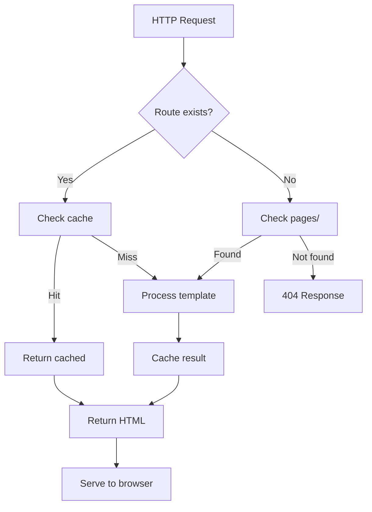
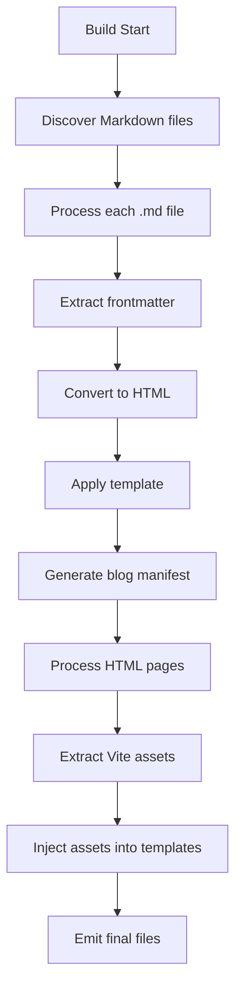

# KBR Builder - Custom Vite Plugin

## Overview

The KBR Builder is a comprehensive custom Vite plugin designed specifically for the Kyle Blank Rollins portfolio site. It provides advanced HTML templating, Markdown processing, blog generation, and development server enhancements that extend Vite's capabilities to meet the specific needs of a static site generator with dynamic content processing.

## Architecture

The builder is implemented as a modular Vite plugin with the following core components:

```
source/builder/
├── index.ts                    # Main plugin entry point and orchestration
├── dev-server-middleware.ts    # Development server routing and live processing
├── markdown-processor.ts       # Markdown to HTML conversion and blog manifest
├── template-processor.ts       # HTML templating engine with variable substitution
├── html-bundle-processor.ts    # Production build HTML processing
├── html-utils.ts              # Shared HTML processing utilities
├── git-aware-pipeline.ts       # Git-aware build coordination and file detection
├── git-utils.ts               # Git repository utilities and change detection
├── helpers.ts                  # File system utilities and logging
└── types.ts                   # TypeScript type definitions
```

## Core Features

### 1. HTML Templating System

**Purpose**: Process HTML pages with includes, variable substitution, and template inheritance

**Key Capabilities**:

- Template-based page generation with variable substitution
- HTML includes for component reusability
- Metadata extraction from HTML comments and attributes
- Automatic title and description generation
- Support for nested templates and partials

**Templates Directory**: `source/site/templates/`

- `base.html` - Base layout template
- `blog-post.html` - Blog post specific template
- Additional templates as needed

**Variable Substitution**:

````html
**Template Syntax**: The system supports three types of template
syntax: 1. **Escaped Variables**: `{{variable}}` - HTML-escaped
content (safe for text) 2. **Unescaped Variables**: `{{{variable}}}` -
Raw HTML content (for HTML injection) 3. **Conditional Sections**:
`{{#variable}}...{{/variable}}` - Show content only if variable exists
```html
<!-- In template files -->
<title>{{title}}</title>
{{#description}}
<meta name="description" content="{{description}}" />
{{/description}} {{#keywords}}
<meta name="keywords" content="{{keywords}}" />
{{/keywords}}
<main>{{{content}}}</main>
````

````

### 2. Markdown Processing

**Purpose**: Convert Markdown files to HTML with frontmatter support and blog manifest generation

**Key Capabilities**:

- GitHub Flavored Markdown (GFM) support
- Frontmatter parsing for metadata (title, date, tags, description)
- Automatic heading ID generation for anchor links
- Blog post manifest generation with tag aggregation
- Draft post exclusion from production builds

**Frontmatter Format**:

```yaml
---
title: "Blog Post Title"
description: "Post description for SEO"
date: "2024-01-15"
tags: ["web-dev", "typescript", "vite"]
keywords: "optional, seo, keywords"
---
# Your Markdown Content Here
````

**Output Locations**:

- Processed HTML: `source/site/content/*.md` → `public/*.html` → `dist/`
- Blog Manifest: `public/data/blog-manifest.json`

### 3. Development Server Enhancements

**Purpose**: Provide live reloading and processing during development

**Key Features**:

- **Route Processing**: Automatically process `.html` files through templates
- **Markdown Live Processing**: Real-time Markdown to HTML conversion
- **Template Hot Reloading**: Changes to templates trigger full page reload
- **Directory Blocking**: Prevent direct access to `/pages/` and `/content/` directories
- **Cache Management**: Intelligent template cache invalidation

**Live Processing Workflow**:

1. Request for `/example.html` received
2. Check for `source/site/pages/example.html`
3. Process through template system with variable substitution
4. Serve processed HTML with proper headers
5. Cache results for performance

### 4. Production Build Processing

**Purpose**: Generate optimized static files for production deployment

**Build Process**:

1. **Markdown Processing**: Convert all `.md` files to `.html`
2. **Asset Discovery**: Extract CSS and JS files from Vite bundle
3. **HTML Processing**: Process all HTML files through template system
4. **Asset Injection**: Automatically inject discovered assets into templates
5. **Bundle Generation**: Output final static files to `dist/`

### 5. Blog System

**Purpose**: Automated blog post management with tag filtering and manifest generation

**Blog Manifest Structure**:

```json
{
  "posts": [
    {
      "title": "Post Title",
      "description": "Post description",
      "date": "2024-01-15",
      "formattedDate": "January 15, 2024",
      "tags": ["web-dev", "typescript"],
      "url": "/blog-post-title.html",
      "filename": "blog-post-title.html"
    }
  ],
  "totalPosts": 1,
  "availableTags": ["web-dev", "typescript"],
  "tagsWithCounts": [
    { "tag": "web-dev", "count": 1 },
    { "tag": "typescript", "count": 1 }
  ],
  "generatedAt": "2024-01-15T12:00:00.000Z"
}
```

### 6. Git-Aware Build Pipeline

**Purpose**: Optimize build performance by only processing files that have actually changed in the git repository

**Key Capabilities**:

- **Intelligent File Detection**: Automatically detect changed markdown and HTML files
- **Conditional Processing**: Skip processing when no relevant files have changed
- **Coordinated Systems**: Unified pipeline that coordinates all git-aware decisions
- **Performance Optimization**: Dramatically reduce build times for incremental changes
- **Flexible Modes**: Support for git-aware, force-all, and standard build modes

**Build Modes**:

```bash
# Git-aware build (only process changed files)
npm run build:git-aware
GIT_AWARE=true vite build

# Force all files (ignore git status)
npm run build:force-all
GIT_AWARE=true FORCE_ALL=true vite build

# Standard build (process all files)
npm run build
```

**Git-Aware Pipeline Architecture**:

```typescript
GitAwareBuildPipeline
├── shouldProcessMarkdown() → Only when .md files change
├── shouldProcessHtml() → Only when source .html files change
├── shouldGenerateBlogManifest() → Only when markdown changes/deletions
├── shouldClearTemplateCache() → Only when templates change
└── Centralized file change detection with caching
```

**Conditional Processing Logic**:

1. **Markdown Processing**: Only runs when `.md` files in `source/site/content/` are modified
2. **HTML Processing**: Only runs when `.html` files in `source/site/pages/` or `source/site/index.html` are modified
3. **Blog Manifest Generation**: Only runs when markdown files change or are deleted
4. **Template Cache**: Intelligently cleared when templates, includes, or pages change

**File Exclusions**:

- **Generated Files**: Files in `/public` directory are excluded (generated by markdown processor)
- **Draft Posts**: Files in `__drafts/` directories are excluded from production
- **Non-Source Files**: Only source files are considered for git-aware processing

**Performance Benefits**:

- **No Changes**: ~540ms build time (skips all processing except core Vite bundle)
- **Markdown Only**: Processes only changed markdown files + generates blog manifest
- **HTML Only**: Processes only changed HTML source files
- **Mixed Changes**: Intelligently processes both markdown and HTML as needed

**Build Logging**:

```
[Build] 🔧 Git repository detected (branch: main)
[Build] 📊 Found 5 changed files
[Build] 📝 Found 2 changed markdown files:
[Build]   - source/site/content/blog-post.md
[Build]   - source/site/content/another-post.md
[Build] 🌐 Found 1 changed HTML files:
[Build]   - source/site/pages/about.html
[Build] ⚡ Git-aware mode: processing 2 changed markdown files
[Build] ⚡ Git-aware mode: processing 1 changed HTML files
[Build] ✓ Generated blog manifest: public/data/blog-manifest.json (5 posts, 8 tags)
```

**Configuration Options**:

```typescript
// vite.config.ts
export default defineConfig({
  plugins: [
    kbrBuilder({
      gitAware: true, // Enable git-aware processing
      baseBranch: "main", // Base branch for comparison
      forceAll: false, // Force process all files
    }),
  ],
});
```

**Environment Variables**:

- `GIT_AWARE=true`: Enable git-aware processing
- `FORCE_ALL=true`: Force processing of all files (overrides git-aware)

## Plugin Integration

### Vite Configuration

```typescript
// vite.config.ts
import { defineConfig } from "vite";
import { kbrBuilder } from "./source/builder/index";

export default defineConfig({
  root: "source/site",
  publicDir: "../../public",
  base: "./",
  build: {
    outDir: "../../dist",
    emptyOutDir: true,
  },
  server: {
    port: 3000,
    open: true,
    watch: {
      ignored: ["!**/pages/**"],
    },
  },
  plugins: [
    kbrBuilder({
      gitAware: process.env.GIT_AWARE === "true",
      forceAll: process.env.FORCE_ALL === "true",
      baseBranch: "main",
    }),
  ],
});
```

### Plugin Hooks Used

The KBR Builder leverages several Vite plugin hooks:

1. **`configureServer`**: Setup development middleware for route processing
2. **`handleHotUpdate`**: Manage hot reloading for templates and pages
3. **`buildStart`**: Process Markdown files and generate blog manifest
4. **`generateBundle`**: Process HTML files and inject assets during build

## File Processing Workflows

### Development Workflow



### Build Workflow



## Component Details

### MarkdownProcessor

**Responsibilities**:

- Parse Markdown files with frontmatter
- Convert Markdown to HTML using marked.js
- Generate automatic heading IDs for anchor navigation
- Aggregate blog post metadata
- Create and maintain blog manifest

**Key Methods**:

- `processMarkdownFile()` - Process individual Markdown file
- `generateBlogManifest()` - Create blog post index
- `setupHeadingRenderer()` - Configure automatic heading IDs

### TemplateProcessor

**Responsibilities**:

- Load and cache HTML templates
- Perform variable substitution ({{variable}})
- Extract metadata from HTML comments
- Handle template inheritance
- Manage template cache invalidation

**Key Methods**:

- `processTemplate()` - Apply template with variables
- `extractMetadata()` - Parse HTML metadata
- `loadTemplate()` - Load template from filesystem
- `clearCache()` - Invalidate template cache

### DevServerMiddleware

**Responsibilities**:

- Intercept HTTP requests during development
- Process HTML files through template system
- Handle Markdown file processing
- Block access to restricted directories
- Manage live reloading

**Middleware Stack**:

1. **Blocking Middleware** - Prevent direct access to source directories
2. **Processing Middleware** - Handle template processing and Markdown conversion
3. **Vite Default** - Handle static assets and other files

### HtmlBundleProcessor

**Responsibilities**:

- Process HTML files during production build
- Extract CSS and JS assets from Vite bundle
- Inject assets into HTML templates
- Generate final static files
- Handle file emission to output directory

**Build Steps**:

1. Extract assets from Vite bundle
2. Process existing HTML files in bundle
3. Discover additional HTML files from pages/
4. Process through template system
5. Inject discovered assets
6. Emit final files to dist/

### HtmlProcessingUtils

**Responsibilities**:

- Shared HTML processing functions
- Title extraction from content
- Template variable preparation
- Asset injection utilities

### GitAwareBuildPipeline

**Responsibilities**:

- Centralized coordination of all git-aware build decisions
- Efficient file change detection with caching
- Conditional processing logic for different file types
- Build strategy logging and reporting

**Key Methods**:

- `shouldProcessMarkdown()` - Determine if markdown processing should run
- `shouldProcessHtml()` - Determine if HTML processing should run
- `shouldGenerateBlogManifest()` - Determine if blog manifest generation should run
- `getChangedMarkdownFiles()` - Get list of changed markdown files
- `getChangedHtmlFiles()` - Get list of changed HTML files
- `logBuildStrategy()` - Log the current build approach and detected changes

**Git-Aware Logic**:

- **Non-Git Repository**: Always process all files
- **Standard Mode**: Always process all files
- **Git-Aware Mode**: Only process files that have changed
- **Force-All Mode**: Process all files but with git-aware logging

### GitUtils

**Responsibilities**:

- Low-level git repository operations
- File change detection using git commands
- Repository status and branch information
- File filtering and path resolution

**Key Methods**:

- `isGitRepository()` - Check if current directory is a git repository
- `getCurrentBranch()` - Get the current git branch name
- `getChangedFiles()` - Get all files that have been modified, added, or renamed
- `getChangedMarkdownFiles()` - Get changed markdown files in content directory
- `getChangedHtmlFiles()` - Get changed HTML files (excludes /public directory)
- `logRepositoryStatus()` - Log current repository status and branch information

**File Detection Logic**:

- Uses `git diff --name-only HEAD` to detect changed files
- Filters results by file extension and directory
- Excludes generated files in `/public` directory
- Handles both modified and newly added files

### FileSystemHelper & BuildLogger

**FileSystemHelper**:

- Recursive file discovery with filtering
- File reading utilities
- Path resolution helpers

**BuildLogger**:

- Consistent build logging with prefixes
- Info, warning, error, and success messages
- Visual indicators for build progress

## Configuration & Customization

### Template Variables

The system supports the following template variables:

```typescript
interface TemplateVariables {
  title: string; // Page title
  description?: string; // Meta description
  keywords?: string; // SEO keywords
  additionalHead?: string; // Additional <head> content
  content: string; // Main page content
  date?: string; // Blog post date (ISO format)
  formattedDate?: string; // Human-readable date
  tags?: string[]; // Blog post tags
  isBlogPost?: boolean; // Blog post flag
}
```

### Metadata Extraction

**HTML Pages**: Metadata is extracted from HTML comments at the top of files:

```html
<!-- title: Page Title -->
<!-- description: Page description for SEO -->
<!-- keywords: seo, keywords, comma separated -->
<!-- template: custom-template.html -->
```

**Markdown Files**: Metadata is extracted from YAML frontmatter:

```yaml
---
title: "Blog Post Title"
description: "Post description for SEO"
date: "2024-01-15"
tags: ["web-dev", "typescript", "vite"]
keywords: "optional, seo, keywords"
---
```

### Template Processing Logic

1. **Variable Substitution**: Process all template variables using regex replacement
2. **Conditional Rendering**: Handle `{{#variable}}...{{/variable}}` blocks
3. **HTML Escaping**: Apply HTML escaping to `{{variable}}` but not `{{{variable}}}`
4. **Asset Injection**: Automatically inject CSS and JS assets during build
5. **Cache Management**: Cache processed templates for performance

### Directory Structure Requirements

```
source/site/
├── pages/              # HTML pages (processed through templates)
├── templates/          # Template files
├── content/           # Markdown blog posts
├── styles/            # CSS files
├── components/        # Lit components
└── main.ts           # Application entry point

public/
├── data/             # Generated data files (blog manifest)
├── styles/           # Static CSS files
└── assets/           # Static assets
```

### Excluding Content

**Draft Posts**: Place in `content/__drafts/` to exclude from production builds

**File Filtering**: The system automatically excludes:

- Files in `__drafts/` directories
- Files starting with `_` (underscore)
- Non-Markdown files in content processing

## Performance Optimizations

### Template Caching

Templates are cached in memory during development to improve performance:

- Cache hit: Instant template serving
- Cache miss: Load from filesystem and cache
- Cache invalidation: Triggered by file changes

### Selective Processing

- Only process files that match specific patterns
- Skip unnecessary file processing during development
- Efficient file discovery with extension filtering

### Hot Module Replacement

Intelligent HMR for different file types:

- **Templates/Includes**: Full page reload (affects multiple pages)
- **Pages**: Full page reload (structural changes)
- **CSS/JS**: Standard Vite HMR (fast updates)
- **Markdown**: Process and reload affected pages

## Error Handling

### Development Errors

- Template parsing errors with file references
- Markdown processing errors with line numbers
- Missing file warnings with helpful suggestions
- Asset injection errors with fallback handling

### Production Build Errors

- Comprehensive error reporting during build
- Graceful handling of missing templates
- Asset discovery failure recovery
- Build process interruption on critical errors

## Debugging & Logging

### Log Levels

- **Info**: General build progress and operations
- **Warning**: Non-critical issues that may need attention
- **Error**: Critical issues that stop the build process
- **Success**: Confirmation of completed operations

### Debug Features

- File discovery logging
- Template processing steps
- Asset injection details
- Cache hit/miss reporting
- Build timing information

## Extension Points

### Adding New Template Variables

1. Extend `TemplateVariables` interface in `template-processor.ts`
2. Add extraction logic in `extractMetadata()` method
3. Update template files to use new variables
4. Document new variables in this README

### Custom Markdown Rendering

1. Extend `MarkdownProcessor` class
2. Override `setupHeadingRenderer()` or add new renderers
3. Configure marked.js options in constructor
4. Add custom post-processing steps

### Additional File Types

1. Add new file extensions to discovery logic
2. Create processor for new file type
3. Integrate with existing template system
4. Add development server middleware for live processing

## NPM Scripts

The KBR Builder supports several npm scripts for different build scenarios:

### Build Scripts

```json
{
  "scripts": {
    "build": "tsc && vite build",
    "build:git-aware": "tsc && GIT_AWARE=true vite build",
    "build:force-all": "tsc && GIT_AWARE=true FORCE_ALL=true vite build",
    "clean:public": "tsx scripts/clean-public.ts"
  }
}
```

**Script Descriptions**:

- **`npm run build`**: Standard build - processes all files regardless of git status
- **`npm run build:git-aware`**: Git-aware build - only processes changed files for optimal performance
- **`npm run build:force-all`**: Force all build - processes all files but with git-aware logging
- **`npm run clean:public`**: Clean orphaned HTML files from public directory

### Development Scripts

```json
{
  "scripts": {
    "dev": "vite",
    "preview": "vite preview",
    "lint:prose": "tsx scripts/lint-prose.ts"
  }
}
```

### Usage Examples

```bash
# Development with live reloading
npm run dev

# Production build (all files)
npm run build

# Optimized build (only changed files)
npm run build:git-aware

# Force build all files with git logging
npm run build:force-all

# Clean generated files
npm run clean:public

# Lint prose content
npm run lint:prose --changed  # Only changed files
npm run lint:prose --drafts   # Only draft files
npm run lint:prose --all      # All files
```

## Troubleshooting

### Common Issues

**Template Not Found**:

- Check template file exists in `source/site/templates/`
- Verify template name matches exactly (case sensitive)
- Ensure template file has `.html` extension

**Variables Not Substituting**:

- Check variable syntax: `{{variableName}}` (no spaces)
- Verify variable exists in TemplateVariables
- Check for typos in variable names

**Hot Reload Not Working**:

- Check file is in watched directory
- Verify Vite configuration includes correct paths
- Clear template cache manually if needed

**Build Failures**:

- Check all Markdown files have valid frontmatter
- Verify all referenced templates exist
- Ensure no circular template dependencies

### Performance Issues

**Slow Development Server**:

- Check template cache hit rate in logs
- Reduce number of files being processed
- Optimize file discovery patterns

**Large Build Times**:

- Profile Markdown processing steps
- Check for unnecessary file processing
- Optimize asset injection logic

## Future Enhancements

### Implemented Features

- **✅ Git-Aware Build Pipeline**: Intelligent file change detection and conditional processing
- **✅ Incremental Builds**: Only process changed files during production builds
- **✅ Blog Manifest Optimization**: Generate blog metadata only when needed
- **✅ Coordinated Processing**: Unified pipeline for all build systems

### Potential Future Improvements

1. **Template Hot Reloading**: Update specific components instead of full reload during development
2. **Asset Optimization**: Automatic image optimization and WebP conversion
3. **SEO Enhancements**: Automatic sitemap generation and meta tag optimization
4. **Performance Monitoring**: Build time analytics and optimization suggestions
5. **Advanced Git Integration**: Support for comparing against different base branches

### Plugin Architecture

The modular design allows for easy extension and maintenance:

- Each component has a single responsibility
- Clear interfaces between components
- Minimal coupling between modules
- Easy to test individual components
- Straightforward to add new features

This architecture provides a solid foundation for a modern static site generator while maintaining the flexibility and performance benefits of Vite's development experience.
