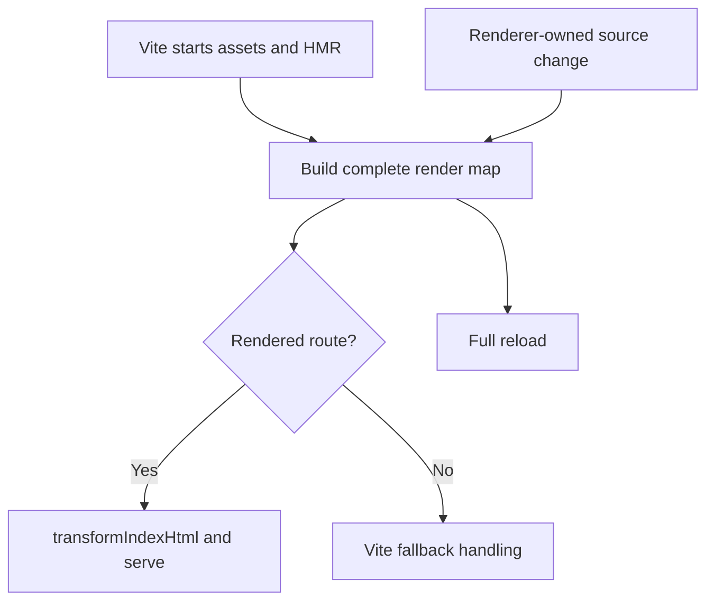
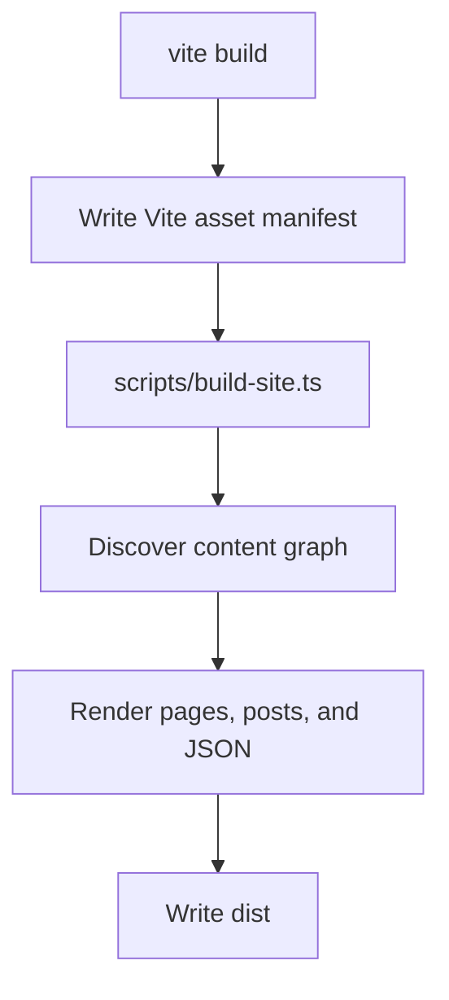

# KBR Builder - Custom Vite Plugin

## Overview

The KBR Builder is a comprehensive custom Vite plugin designed specifically for the Kyle Blank Rollins portfolio site. It provides advanced HTML templating, Markdown processing, blog generation, and development server enhancements that extend Vite's capabilities to meet the specific needs of a static site generator with dynamic content processing.

## Architecture

The builder is implemented as a modular Vite plugin with the following structure:

```
source/builder/
├── index.ts                    # Development plugin integration
├── dev-server-middleware.ts    # Development server routing and live processing
├── markdown-processor.ts       # Markdown orchestrator (uses modules)
├── template-processor.ts       # Template orchestrator (uses modules)
├── html-bundle-processor.ts    # Production output writing
├── helpers.ts                  # Build logging utilities
├── site-content.ts             # Site content model construction
├── site-renderer.ts            # Rendered site model
├── static-content.ts           # Static page and blog content
├── static-blog-enhancement.ts  # Client-side blog enhancement
└── modules/                    # Focused, reusable processing modules
    ├── index.ts                # Barrel export for all modules
    ├── html-utils.ts           # HTML escaping and manipulation utilities
    ├── citation-processor.ts   # Citation parsing and footnote generation
    ├── frontmatter-parser.ts   # YAML frontmatter extraction and parsing
    ├── content-discovery.ts    # Normalized content document discovery/validation
    ├── markdown-renderer.ts    # Marked.js configuration with custom renderers
    ├── content-preprocessor.ts # Content transformation before rendering
    ├── blog-manifest.ts        # Blog manifest building and validation
    └── html-ast-renderer.ts    # parse5-based directive renderer
```

### Modular Design

The builder follows a **modular architecture** where complex processors delegate to focused, single-responsibility modules:

- **Processors** (`markdown-processor.ts`, `template-processor.ts`): Thin orchestrators that coordinate module interactions
- **Modules** (`modules/`): Reusable, testable components with clear boundaries
- **Shared utilities**: Common functionality used across multiple modules

This design enables:

- **Better testability**: Each module can be tested independently
- **Code reusability**: Modules used by multiple processors
- **Easier maintenance**: Smaller files with focused responsibilities
- **Improved organization**: Clear separation of concerns

## Processing Modules

The `modules/` directory contains focused, reusable components that handle specific aspects of content processing:

### Shared Utilities

#### html-utils.ts

Pure utility functions for HTML manipulation:

- `escapeHtml()` - Escape text for use in HTML content and attributes

#### citation-processor.ts

Citation parsing and footnote generation:

- Parse citations from YAML frontmatter
- Process `[^id]` references in content → superscript links
- Generate HTML for citations/footnotes section
- Validate citation IDs and detect duplicates/unused citations

#### frontmatter-parser.ts

YAML frontmatter extraction and parsing:

- Extract frontmatter from markdown files
- Parse metadata fields (title, description, date, tags, series)
- Format dates with timezone handling
- Parse series information for multi-part blog posts

#### content-discovery.ts

Normalized content-document discovery and validation:

- Uses `source/site/content/published/` as the publishable content root
- Discovers standalone posts and directory parent posts
- Classifies supplement markdown under reserved `supplements/` directories
- Validates structure and rejects duplicate public output URLs before emission

### Markdown Processing Modules

#### markdown-renderer.ts

Marked.js configuration with custom renderers:

- Custom heading renderer (auto-generates IDs for anchor links)
- Source-aware local markdown link resolution (rewrites relative `.md` targets via discovery index)
- Custom code renderer (Prism.js syntax highlighting)
- Language normalization for code blocks

#### content-preprocessor.ts

Content transformation before rendering:

- `stripComments()` - Remove JS/CSS comments (preserves code block comments)
- `preprocessAdmonitions()` - Process markdown inside `<kbr-admonition>` tags

#### blog-manifest.ts

Blog manifest building and validation:

- Add posts to manifest with metadata
- Sort posts by date (newest first)
- Aggregate tags with counts
- Validate series (check for duplicates, detect gaps in part numbers)
- Generate JSON manifest output

### Template Processing

`html-ast-renderer.ts` parses templates with `parse5` and applies the closed
`data-kbr-*` directive contract for includes, page metadata, layouts, slots,
conditionals, escaped interpolation, raw fragments, and asset placement.

## Core Features

### 1. HTML Templating System

**Purpose**: Process HTML pages with includes, variable substitution, and template inheritance

**Key Capabilities**:

- Template-based page generation with variable substitution
- HTML includes for component reusability
- Metadata extraction from HTML comments and attributes
- Automatic title and description generation
- Support for nested templates and partials

**Templates Directory**: `source/site/templates/`

- `base.html` - Base layout template
- `blog-post.html` - Blog post specific template
- Additional templates as needed

**Variable Substitution**:

Template syntax:

- `{{variable}}` - HTML-escaped content
- `{{{variable}}}` - Unescaped HTML content
- `{{#variable}}...{{/variable}}` - Conditional block rendered only when variable exists

```html
<!-- In template files -->
<title>{{title}}</title>
{{#description}}
<meta name="description" content="{{description}}" />
{{/description}} {{#keywords}}
<meta name="keywords" content="{{keywords}}" />
{{/keywords}}
<main>{{{content}}}</main>
```

### 2. Markdown Processing

**Purpose**: Convert Markdown files to HTML with frontmatter support and blog manifest generation

**Key Capabilities**:

- GitHub Flavored Markdown (GFM) support
- Frontmatter parsing for metadata (title, date, tags, description)
- Supplement publishing for `post-directory/supplements/*.md` files using required `published` boolean frontmatter
- Source-aware local markdown links for parent/supplement relationships with fragment/query preservation
- Build-blocking validation for missing, unpublished, ambiguous, or traversal local markdown targets
- Automatic heading ID generation for anchor links
- Blog post manifest generation with tag aggregation
- Draft post exclusion from production builds

**Frontmatter Format**:

```yaml
---
title: "Blog Post Title"
description: "Post description for SEO"
date: "2024-01-15"
tags: ["web-dev", "typescript", "vite"]
keywords: "optional, seo, keywords"
---
Your markdown content starts here.
```

**Note**: The title from frontmatter is automatically injected as an H1 heading at the top of your post. You don't need to duplicate it in the markdown content. The first heading in your content should be H2 (`##`).

**Output Locations**:

- Processed HTML: `source/site/content/published/**/*.md` → in-memory generated files → emitted to `dist/`
- Standalone output example: `published/post.md` → `/post.html`
- Directory supplement output example: `published/post/supplements/notes.md` → `/post/supplements/notes.html`
- Blog Manifest output: `data/blog-manifest.json` (served at `/data/blog-manifest.json`)

### Discovery and URL Normalization Contract

The builder performs discovery before rendering:

1. Scan only `source/site/content/published/` for production candidates.
2. Classify top-level markdown files as standalone posts.
3. Classify `post-directory/supplements/*.md` files as supplement candidates.
4. Require exactly one directory parent file named `directory-name.md`.
5. Validate publication metadata for supplements (`published: true|false`).
6. Build a normalized source-to-public URL map used by build and dev routing.

Manifest and relationship behavior:

- Top-level `posts` contains only parent posts.
- Published supplements are attached under each parent post's optional `supplements` field.
- Supplements do not affect top-level post count, tag counts, or series sequencing.

Supplement behavior:

- `published: true` supplements are emitted at nested URLs such as `/post/supplements/notes.html`
- `published: false` supplements are excluded from HTML output and parent links
- Supplements are aggregated under the parent post's optional `supplements` manifest field and are not added to top-level post counts

Local markdown link behavior:

- Relative markdown links (for example `supplements/notes.md` or `../post.md`) are resolved from the current source document path.
- Rewrites are source-index driven, not global extension swaps.
- Fragments and query strings are preserved when rewritten to public URLs.
- External URLs and already-public URLs are not rewritten.
- Invalid targets throw actionable build errors with source document, original target, and resolved source location.

### 3. Development Server Enhancements

**Purpose**: Provide live reloading for renderer-owned documents during development.

**Key Features**:

- **Rendered Map**: Build every page and publishable Markdown document in memory
- **Public URL Resolution**: Resolve generated content by normalized public URL, including nested supplement routes
- **Renderer-Owned Reloads**: Changes to pages, templates, content, themes, data, or the site index rebuild the complete map and trigger a full reload
- **Vite Ownership**: Vite serves client assets and owns MIME types, source paths, and not-found responses

**Live Processing Workflow**:

1. Vite starts the asset pipeline and HMR server.
2. The builder discovers and renders the complete site map.
3. Requests matching a rendered document are passed through `transformIndexHtml()` and served from memory.
4. Renderer-owned file changes rebuild the complete map and send a full reload.

### 4. Production Build Processing

**Purpose**: Generate optimized static files for production deployment

**Build Process**:

1. **Markdown Processing**: Convert all `.md` files to `.html`
2. **Asset Discovery**: Extract CSS and JS files from Vite bundle
3. **HTML Processing**: Process all HTML files through template system
4. **Asset Rendering**: Resolve Vite manifest assets in renderer-owned placeholders
5. **Bundle Generation**: Output final static files to `dist/`

### 5. Asset Handling

Vite owns client asset compilation and development transforms. The production workflow reads Vite's `.vite/manifest.json` through `siteAssetsFromManifest()` and passes the resulting asset URLs to `renderSite()`. The renderer writes those tags into every generated document, so asset placement is deterministic and independent of plugin lifecycle hooks.

Development documents use `/main.ts` and Vite's normal HMR transform. The builder does not inject or remove development scripts.

### 6. Blog System

**Purpose**: Automated blog post management with tag filtering and manifest generation

**Blog Manifest Structure**:

```json
{
  "posts": [
    {
      "title": "Post Title",
      "description": "Post description",
      "date": "2024-01-15",
      "formattedDate": "January 15, 2024",
      "tags": ["web-dev", "typescript"],
      "url": "/blog-post-title.html",
      "filename": "blog-post-title.html"
    }
  ],
  "totalPosts": 1,
  "availableTags": ["web-dev", "typescript"],
  "tagsWithCounts": [
    { "tag": "web-dev", "count": 1 },
    { "tag": "typescript", "count": 1 }
  ]
}
```

### 6. Production and Development Workflows

Production uses one explicit sequence:

1. `vite build` compiles the client assets and writes `.vite/manifest.json`.
2. `scripts/build-site.ts` discovers the complete content graph and renders every document.
3. The renderer reads the Vite manifest and writes the complete site to `dist/`.

Development runs `vite` with the builder's rendered-document middleware. It builds the complete in-memory render map, passes HTML through `transformIndexHtml()`, and rebuilds the map on renderer-owned source changes.

The supported commands are:

```bash
npm run dev
npm run build
npm run preview
```

### Legacy Incremental Building

Incremental processing is not supported. Builds always process the complete content graph so generated HTML, manifests, and stale-output behavior remain deterministic.

## Plugin Integration

### Vite Configuration

```typescript
// vite.config.ts
import { defineConfig } from "vite";
import { kbrBuilder } from "./source/builder/index";

export default defineConfig({
  root: "source/site",
  publicDir: "../../public",
  base: "/",
  build: {
    outDir: "../../dist",
    emptyOutDir: true,
    manifest: true,
  },
  server: {
    port: 3000,
    watch: {
      ignored: ["!**/pages/**"],
    },
  },
  plugins: [kbrBuilder()],
});
```

## File Processing Workflows

### Development Workflow



### Build Workflow



## Component Details

### MarkdownProcessor

**Responsibilities**:

- Parse Markdown files with frontmatter
- Convert Markdown to HTML using marked.js
- Generate automatic heading IDs for anchor navigation
- Aggregate blog post metadata
- Create and maintain blog manifest

**Key Methods**:

- `processContentDocument()` - Process an individual discovered Markdown document
- `generateBlogManifest()` - Create blog post index

### TemplateProcessor

**Responsibilities**:

- Apply the `data-kbr-*` directive contract through the AST renderer
- Render page content into layout slots
- Pass assets to head and body placeholders

**Key Methods**:

- `processTemplate()` - Render content with the selected AST layout

<!-- Content starts here - comments above are stripped -->
<section class="hero">...</section>
```

This enhancement ensures that:

1. Metadata is properly extracted for template variable substitution
2. Metadata comments don't appear in the final rendered HTML
3. Content remains clean and properly formatted

### DevServerMiddleware

**Responsibilities**:

- Intercept HTTP requests during development
- Serve documents from the complete in-memory render map
- Pass HTML through Vite's `transformIndexHtml()`
- Rebuild and reload when renderer-owned files change

**Middleware Stack**:

1. **Rendered Document Middleware** - Serve renderer-owned HTML from memory
2. **Vite Default** - Handle assets, source files, and errors

### HtmlBundleProcessor

**Responsibilities**:

- Read Vite's asset manifest after production compilation
- Render the complete site through `renderSite()`
- Write generated HTML and renderer-owned JSON to `dist/`

**Build Steps**:

1. Read `.vite/manifest.json`
2. Load source and collect the validated content graph
3. Render pages, posts, and JSON outputs
4. Emit final files to `dist/`

### HtmlProcessingUtils

**Responsibilities**:

- Shared HTML processing functions
- Title extraction from content
- Template variable preparation

**BuildLogger**:

- Consistent build logging with prefixes
- Info, warning, error, and success messages
- Visual indicators for build progress

## Configuration & Customization

### Template Variables

The system supports the following template variables:

```typescript
interface TemplateVariables {
  title: string; // Page title
  description?: string; // Meta description
  keywords?: string; // SEO keywords
  additionalHead?: string; // Additional <head> content
  content: string; // Main page content
  date?: string; // Blog post date (ISO format)
  formattedDate?: string; // Human-readable date
  tags?: string[]; // Blog post tags
  isBlogPost?: boolean; // Blog post flag
}
```

### Metadata Extraction

**HTML Pages**: Metadata is extracted from HTML comments at the top of files:

```html
<!-- title: Page Title -->
<!-- description: Page description for SEO -->
<!-- keywords: seo, keywords, comma separated -->
<!-- template: custom-template.html -->
```

**Markdown Files**: Metadata is extracted from YAML frontmatter:

```yaml
---
title: "Blog Post Title"
description: "Post description for SEO"
date: "2024-01-15"
tags: ["web-dev", "typescript", "vite"]
keywords: "optional, seo, keywords"
---
```

### Template Processing Logic

1. **Variable Substitution**: Process all template variables using regex replacement
2. **Conditional Rendering**: Handle `{{#variable}}...{{/variable}}` blocks
3. **HTML Escaping**: Apply HTML escaping to `{{variable}}` but not `{{{variable}}}`
4. **Asset Placeholders**: Resolve renderer-owned Vite asset URLs from the production manifest

### Directory Structure Requirements

```
source/site/
├── pages/              # HTML pages (processed through templates)
├── templates/          # Template files
├── content/
│   ├── published/      # Publishable markdown content root
│   └── __drafts/       # Draft-only markdown content
├── styles/            # CSS files
├── components/        # Lit components
└── main.ts           # Application entry point

public/
├── data/             # Generated data files (blog manifest)
├── styles/           # Static CSS files
└── assets/           # Static assets
```

### Excluding Content

**Draft Posts**: Place in `content/__drafts/` to exclude from production builds

**File Filtering**: The system automatically excludes:

- Files in `__drafts/` directories
- Files starting with `_` (underscore)
- Non-Markdown files in content processing

### Hot Module Replacement

Renderer-owned changes trigger a complete render-map rebuild and full reload:

- **Templates/Includes**: Full page reload (affects multiple pages)
- **Pages**: Full page reload (structural changes)
- **CSS/JS**: Standard Vite HMR (fast updates)
- **Markdown**: Rebuild all rendered documents and reload

## Error Handling

### Development Errors

- Template parsing errors with file references
- Markdown processing errors with line numbers
- Missing file warnings with helpful suggestions
- Asset URLs that are missing from the Vite manifest

### Production Build Errors

- Comprehensive error reporting during build
- Graceful handling of missing templates
- Asset discovery failure recovery
- Build process interruption on critical errors

## Debugging & Logging

### Log Levels

- **Info**: General build progress and operations
- **Warning**: Non-critical issues that may need attention
- **Error**: Critical issues that stop the build process
- **Success**: Confirmation of completed operations

### Debug Features

- File discovery logging
- Template processing steps
- Asset manifest entries
- Build timing information

## Extension Points

### Adding New Template Variables

1. Extend `TemplateVariables` interface in `template-processor.ts`
2. Add extraction logic in the appropriate metadata module
3. Update template files to use new variables
4. Document new variables in this README

### Custom Markdown Rendering

1. Extend `MarkdownProcessor` class
2. Update the MarkdownRenderer module or add new renderers
3. Configure marked.js options in constructor
4. Add custom post-processing steps

### Additional File Types

1. Add new file extensions to discovery logic
2. Create processor for new file type
3. Integrate with existing template system
4. Add development server middleware for live processing

## NPM Scripts

The KBR Builder uses one production command and one development command:

### Build Scripts

```json
{
  "scripts": {
    "build": "tsc && vite build && tsx scripts/build-site.ts",
    "dev": "vite"
  }
}
```

**Script Descriptions**:

- **`npm run build`**: Compile assets, render the complete content graph, and write `dist/`
- **`npm run dev`**: Run Vite with the complete rendered development site

### Development Scripts

```json
{
  "scripts": {
    "dev": "vite",
    "preview": "vite preview",
    "lint:prose": "tsx scripts/lint-prose.ts --changed-only",
    "lint:prose:all": "tsx scripts/lint-prose.ts",
    "lint:prose:drafts": "tsx scripts/lint-prose.ts --drafts-only"
  }
}
```

### Usage Examples

```bash
# Development with live reloading
npm run dev

# Production build (all files)
npm run build

# Lint prose content
npm run lint:prose            # Changed files
npm run lint:prose:drafts     # Draft files
npm run lint:prose:all        # All files
```

## Troubleshooting

### Common Issues

**Template Not Found**:

- Check template file exists in `source/site/templates/`
- Verify template name matches exactly (case sensitive)
- Ensure template file has `.html` extension

**Variables Not Substituting**:

- Check variable syntax: `{{variableName}}` (no spaces)
- Verify variable exists in TemplateVariables
- Check for typos in variable names

**Hot Reload Not Working**:

- Check file is in watched directory
- Verify Vite configuration includes correct paths
- Confirm the changed path is renderer-owned: pages, templates, content, themes, or the site index

**Build Failures**:

- Check all Markdown files have valid frontmatter
- Verify all referenced templates exist
- Ensure no circular template dependencies

### Performance Issues

**Slow Development Server**:

- Reduce unrelated file discovery and keep renderer-owned source changes focused

**Large Build Times**:

- Profile Markdown processing steps
- Check for unnecessary file processing
- Profile Markdown processing and graph discovery before adding caching

## Future Enhancements

### Potential Future Improvements

1. **Template Hot Reloading**: Update specific components instead of full reload during development
2. **Asset Optimization**: Automatic image optimization and WebP conversion
3. **SEO Enhancements**: Automatic sitemap generation and meta tag optimization
4. **Performance Monitoring**: Build time analytics and optimization suggestions

### Plugin Architecture

The modular design allows for easy extension and maintenance:

- Each component has a single responsibility
- Clear interfaces between components
- Minimal coupling between modules
- Easy to test individual components
- Straightforward to add new features

This architecture provides a solid foundation for a modern static site generator while preserving stable public URLs during incremental migration from standalone posts to directory-based posts with supplements.
