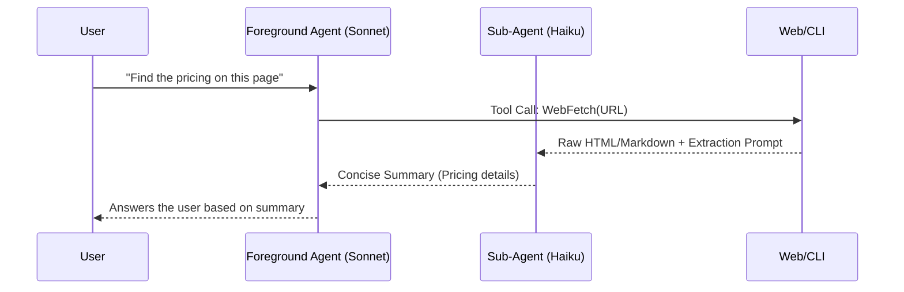

Is there a difference in how humans and AI agents interpret signposting in writing? Does signposting help agents? If yes, why? If no, does it hinder and how can writers serve both human and agent audiences?

Example articles:

- https://style.mla.org/effective-signposting/
- https://www.ncl.ac.uk/academic-skills-kit/writing/academic-writing/signposting/

## Research Synthesis

### Answering the Draft's Central Questions

The draft asks: _"Is there a difference in how humans and AI agents interpret signposting in writing? Does signposting help agents? If yes, why? If no, does it hinder and how can writers serve both human and agent audiences?"_

#### 1. Is there a difference? — Yes, fundamentally.

Human signposting operates at the **discourse level** — transition words ("however," "furthermore"), topic sentences, forward/backward references (#1, #2, #3). These are linguistic cues that manage reading flow, set expectations, and signal argument structure. They're processed interpretively: a reader infers meaning from context and convention.

AI signposting operates at the **structural level** — Markdown headings, XML tags, explicit section ordering, numbered steps (#7, #8). These are parsed mechanistically: an AI system uses them as literal delimiters for chunking (#16, #17), retrieval (#19), and prompt structure. The distinction maps onto Maschler's discourse marker taxonomy (#3): AI excels at **referential** and **structural** markers but likely gains little from **interpersonal** and **cognitive** markers.

#### 2. The LLM-to-LLM Summarization Architecture

To understand how agents interpret signposting, we have to look at how they actually read web pages. Autonomous developer agents (like Claude Code) rarely read raw page content directly in their primary context window. Instead, they use a **secondary conversation architecture**.

When an agent fetches a web page:

1. **Local Fetch:** The CLI fetches the raw page content.
2. **The Sub-Agent (e.g., Haiku):** A completely hidden, secondary LLM conversation is spawned. The raw page content is dumped into this context window along with strict extraction instructions.
3. **The Summary:** The sub-agent summarizes the content to answer the specific task.
4. **The Foreground Agent:** The primary model (e.g., Claude 3.5 Sonnet) _only_ receives the sub-agent's summary.

#### 3. Surviving the Summarizer: Does signposting help agents?

Yes, but it's a different _kind_ of signposting. Since the primary audience of your webpage is now a fast, task-oriented sub-agent trying to quickly extract an answer from a raw text dump, your signposting strategy must adapt to survive this summarization bottleneck:

- **Markdown is the New Transition Word:** When a sub-agent processes a massive block of raw text, structural markers (`#`, `##`, `-`) are the only reliable way it can navigate hierarchy. A strong `<h2>` acts as literal instructions to the summarizer.
- **The "Prompt Injection" of Good Structure:** Clear structural signposting acts as an instruction set for the LLM. If your content is front-loaded and clearly delineated by headers, the sub-agent doesn't have to "guess" where the answer is.
- **Narrative Flow is Dead:** Interpersonal signposts ("As we saw earlier...") and verbose transition words are completely lost on a sub-agent. They increase token count without adding semantic content, and are actively stripped out during summarization.

#### 4. Can writers serve both audiences? — Yes, through structural signposting.

The EPPO framework (#20) provides the theoretical bridge. Baker's principle that every topic must be self-contained and establish its own context maps perfectly to AI retrieval needs.

**The sweet spot: Markdown-structured, self-contained content.**

- Docs-as-code (#15) naturally produces AI-readable content by stripping visual presentation.
- Markdown headings serve as both human navigation and AI chunk boundaries.
- GitHub's content model (#4, #22) is a form of structural signposting that works for both audiences.

### Proposed Thesis Arc for the Post

1. **Signposting is familiar** — we already do it for human readers using prose and transitions.
2. **The New AI Reality** — how agentic retrieval actually works (Foreground Agent -> Fetching Sub-Agent -> Summary).
3. **Surviving the Summarization Filter** — why structural signposting (headers, chunks) is the only way to ensure your core message survives the translation from raw page to summary.
4. **The spectrum**: Prose markers (human) → Structural markup (both) → Machine protocols like llms.txt (AI).
5. **The Dual-Audience Sweet Spot** — how writing modular, structurally clear, and front-loaded content serves both human web foragers and AI summarizers.

### Potential Analogies / Frameworks

- **Signposting as wayfinding**: Humans need trail markers on a hiking path; AI needs GPS coordinates. Both navigate the same terrain, but with different tools.
- **Signposting as an Executive Summary**: Structural markers are the bold bullet points that make it to the CEO's desk. The sub-agent acts as the executive assistant, filtering out the fluff and passing only the clearly highlighted facts.
- **USB-C analogy** (from MCP #13): MCP is like USB-C for AI. Similarly, Markdown headings are like road signs — a standardized signposting format that both humans and machines can read.

### Gaps and Areas for Further Research

- **Empirical testing**: No study yet directly compares how LLMs perform on documents with/without traditional signposting (transition words).
- **Dual-audience writing guides**: No established style guide specifically addresses writing for both human and AI readers simultaneously.
- **Industry examples**: Beyond Stripe's llms.txt (#11), more examples of companies adapting their documentation for AI consumption would strengthen the argument.

### Source Quality Summary

| #   | Source                          | Confidence      | Relevance                                      |
| --- | ------------------------------- | --------------- | ---------------------------------------------- |
| 1   | MLA Effective Signposting       | 95%             | High — establishes human baseline              |
| 2   | Newcastle Signposting           | 90%             | High — taxonomy of signpost types              |
| 3   | Wikipedia Discourse Marker      | 90%             | Medium — linguistic theory                     |
| 4   | GitHub Content Model            | 95%             | High — structural signposting in practice      |
| 5   | Lost in the Middle (Liu et al.) | 100% (abstract) | High — positional bias in LLMs                 |
| 6   | Principled Instructions         | 100% (abstract) | Medium — prompt engineering as signposting     |
| 7   | Anthropic Prompt Engineering    | 90%             | Very High — AI signposting best practices      |
| 8   | OpenAI Prompt Engineering       | 85%             | Very High — AI signposting best practices      |
| 10  | llmstxt.org                     | 95%             | Very High — machine-readable signposting spec  |
| 11  | Stripe llms.txt                 | 95%             | Very High — real-world AI signposting          |
| 13  | MCP Introduction                | 90%             | High — protocol-level signposting              |
| 14  | LongLLMLingua (Jiang et al.)    | 100% (abstract) | High — counter-argument on information density |
| 15  | Write the Docs Docs-as-Code     | 90%             | Medium — bridge to AI readability              |
| 16  | Pinecone Chunking Strategies    | 95%             | High — headings as AI signposts                |
| 17  | Unstructured Chunking for RAG   | 90%             | High — structural boundaries for AI            |
| 18  | Dense X Retrieval (Chen et al.) | 100% (abstract) | High — proposition-level retrieval             |
| 19  | Anthropic Contextual Retrieval  | 95%             | Very High — context as signposting             |
| 20  | Every Page is Page One (Baker)  | 60% (outline)   | Very High — dual-audience theory               |
| 22  | GitHub Style Guide              | 95%             | Medium — structural signposting rules          |
