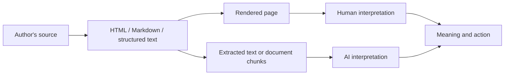

## Working thesis

Syntax, semantics, and pragmatics shape how information is understood and used by both humans and AI systems. Humans usually encounter a document's syntax through its rendered presentation, while AI tools may encounter the underlying HTML, Markdown, structured data, or extracted text directly. Writers should therefore treat document structure as part of the meaning, not merely as presentation.

The sharper version of the claim is this:

> Good information design makes meaning survive changes in representation.

A document may move from Markdown to HTML, from HTML to an accessibility tree, from a page to a retrieval chunk, or from a retrieval chunk to a model-generated summary. The important question is whether its semantics and intended use survive those transformations.

## Questions to answer

- What is syntax, and how is it different from semantics and pragmatics?
- How does syntax create or expose structure?
- How does structure communicate relationships, priority, and expected action?
- How do programming languages, markup languages, and prose use syntax differently?
- How do humans interpret the same source through rendering, typography, and visual grouping?
- How might AI tools encounter the source through HTML, Markdown, raw text, chunks, metadata, or summaries?
- What meaning is preserved or lost when content is transformed between those representations?
- How can technical writers design documents that work for both audiences?

## Core framework

Use one example throughout the post:

```markdown
## Rotate an API key

Rotate the key every 90 days.

1. Create a replacement key.
2. Update the application configuration.
3. Revoke the old key.
```

- **Syntax:** The heading, paragraph, and numbered list establish a document structure.
- **Semantics:** The content says that key rotation happens every 90 days and identifies the required operations.
- **Pragmatics:** The reader should create and configure the replacement before revoking the old key.

The same document can have different parsing paths:



Humans may not consciously see an HTML heading element, but they recognize its rendered role as a heading. An AI tool may receive the heading as HTML, Markdown, a cleaned text conversion, an accessibility representation, or part of a retrieval chunk. The representation changes, but the author's structural decisions still matter.

## Proposed outline

### 1. Syntax is not just for programming languages

Introduce syntax as an arrangement of signs governed by conventions. Programming languages, Markdown, HTML, software interfaces, configuration files, and prose all have syntax.

The syntax may be formal or flexible, but it still establishes relationships. A compiler, parser, browser, human reader, or AI system uses those relationships to determine what belongs together and what can happen next.

### 2. Structure carries relationships

Explain that structure is not an empty container around meaning:

- A heading establishes topic hierarchy.
- A numbered list establishes sequence.
- A bulleted list establishes membership or alternatives.
- A table establishes comparison.
- A code block marks something to inspect, copy, or execute.
- A warning or prerequisite label changes priority and expected behavior.

This is where the post can connect syntax to information architecture and to the idea that technical writers design small domain-specific languages. Documentation conventions teach an audience how to parse a page.

### 3. Meaning has layers

Define the three terms without treating them as interchangeable:

- **Syntax:** The form and arrangement of signs.
- **Semantics:** What those signs and relationships represent.
- **Pragmatics:** What an audience should infer, prioritize, or do in context.

Use the API key example to show that a document can be syntactically valid while still being semantically incomplete or pragmatically confusing.

### 4. Humans see the rendered interface

Describe the human reading path. People interpret linguistic syntax, document structure, typography, spacing, visual grouping, tone, and prior experience together.

Humans are often able to reconstruct missing relationships from context. That flexibility is useful, but it can also hide ambiguity from the author. A page may look obvious to its writer because the writer already knows what the structure is supposed to mean.

### 5. AI tools see a representation

Explain that AI systems do not all consume content in the same way. Depending on the tool, they may receive:

- Source HTML or Markdown
- Cleaned or flattened text
- An accessibility tree
- Metadata and structured data
- Retrieved chunks
- A summary produced by another model

This is where ideas from the signposting research belong. Headings, lists, and explicit section boundaries can support retrieval and chunking. Self-contained sections can preserve context when content is encountered out of sequence. Clear instructions can distinguish background, requirements, examples, and actions.

Avoid claiming that AI systems ignore prose signposting. The more defensible point is that prose-level and structural signposting operate at different layers. Both can help, but explicit structure is more likely to survive extraction and transformation.

### 6. The danger is semantic drift

Show how meaning can be lost as content changes form:

- A visual distinction may disappear when styling is removed.
- A heading may be separated from the section it describes.
- A pronoun may become ambiguous when a chunk loses its preceding context.
- A procedure may look like a list of suggestions if sequence is not represented clearly.
- A recommendation may be mistaken for a requirement if its pragmatic force is not labeled.

Connect this to AI retrieval and summarization. Content is more robust when important claims carry enough local context to remain meaningful outside the full page.

### 7. Design for meaning to survive

Offer practical principles for dual-audience documentation:

- Give every section a descriptive heading.
- Make each section locally understandable.
- State conditions, requirements, and outcomes explicitly.
- Use lists for sequence and membership, not decoration.
- Use terms consistently.
- Put important context near the claim it qualifies.
- Use markup according to its semantic role.
- Do not rely on styling alone to communicate meaning.
- Keep prose signposting when it clarifies relationships.
- Avoid adding structure that does not correspond to a real relationship.

The goal is not to write for machines instead of humans. It is to choose structures that make the intended meaning and permitted actions explicit for both audiences.

### 8. Structure is a responsibility

Conclude that technical writers are not only choosing words. They are designing a language and an interface whose meaning must survive multiple readers and multiple transformations.

The future of AI-readable documentation is not necessarily a separate machine dialect. It is documentation whose syntax makes its semantics and intended use explicit enough to survive rendering, extraction, retrieval, and action.

## Possible examples

- Compare a visually clear page with its flattened text representation.
- Compare a vague authentication instruction with a procedure that names prerequisites, sequence, and result.
- Use this site's Markdown-to-HTML build process as a concrete example of one source becoming several representations.
- Use an agent skill's frontmatter and section structure as an example of a small language designed for machine discovery and execution.
- Connect the post to the existing ideas in `docs-as-interface.md` and `ai-agent-workflows.md` without repeating their main arguments.

## Specific resources to pull over

These are the resources worth carrying over from the signposting research. They support the argument without requiring this post to reproduce the entire signposting bibliography.

### Primary sources

- [Effective Signposting](https://style.mla.org/effective-signposting/): MLA Style Center. Use this for the human baseline: signposting clarifies structure and direction, but excessive signposting creates wordiness. This supports the distinction between useful structure and structure added merely to compensate for weak organization.
- [Contents of a GitHub Docs article](https://docs.github.com/en/contributing/style-guide-and-content-model/contents-of-a-github-docs-article): GitHub Docs. Use this as a concrete example of information-architecture syntax. Its prescribed sequence shows that document structure can communicate expectations before a reader processes individual sentences.
- [Introducing Contextual Retrieval](https://www.anthropic.com/news/contextual-retrieval): Anthropic. Use this as the strongest bridge to semantics and pragmatics: a retrieved chunk can contain accurate words but still be unusable when it lacks the context that identifies its subject or scope.

### Supporting sources

- [Signposting](https://www.ncl.ac.uk/academic-skills-kit/writing/academic-writing/signposting/): Newcastle University Academic Skills Kit. Use its distinction between signposting of order and signposting of relations to give the post a useful vocabulary for discussing document structure.
- [Chunking Strategies for LLM Applications](https://www.pinecone.io/learn/chunking-strategies/). Use this for the claim that headings, lists, and other structural cues can produce more coherent retrieval chunks. The idea that a chunk should make sense without its surrounding context also connects human and AI readability.
- [Every Page is Page One](https://everypageispageone.com/the-book/): Mark Baker. Use this as the human-centered theory behind self-contained sections. Readers can arrive at a page from anywhere, which makes local context a requirement for both web readers and retrieval systems.

### Optional machine-oriented examples

- [Prompting best practices: Be clear and direct](https://platform.claude.com/docs/en/docs/build-with-claude/prompt-engineering/be-clear-and-direct): Anthropic. Use this as an example of explicit structural syntax for AI: XML delimiters, numbered steps, document ordering, and context placement.
- [The /llms.txt file](https://llmstxt.org/) and [Stripe's documentation llms.txt](https://docs.stripe.com/llms.txt). Use these only if the post needs an example of structure moving from document conventions toward a machine-oriented site protocol. They are useful illustrations, but they should not become the post's main argument.

Do not carry over the signposting draft's claims about a universal foreground-agent/sub-agent architecture or that narrative flow is "dead." Those claims are more tool-specific and more absolute than this post needs. The durable point is that content may be rendered, extracted, chunked, summarized, or retrieved, so its important relationships should remain explicit across those transformations.

## Questions to keep honest

- Do not imply that all AI systems parse source markup directly.
- Do not claim that humans only understand rendered output; humans also interpret language and document conventions directly.
- Do not present syntax as sufficient for meaning. Context, shared conventions, world knowledge, and audience expectations still matter.
- Do not argue that human-oriented prose signposting is useless. The useful distinction is between linguistic signposting and structural signposting.
